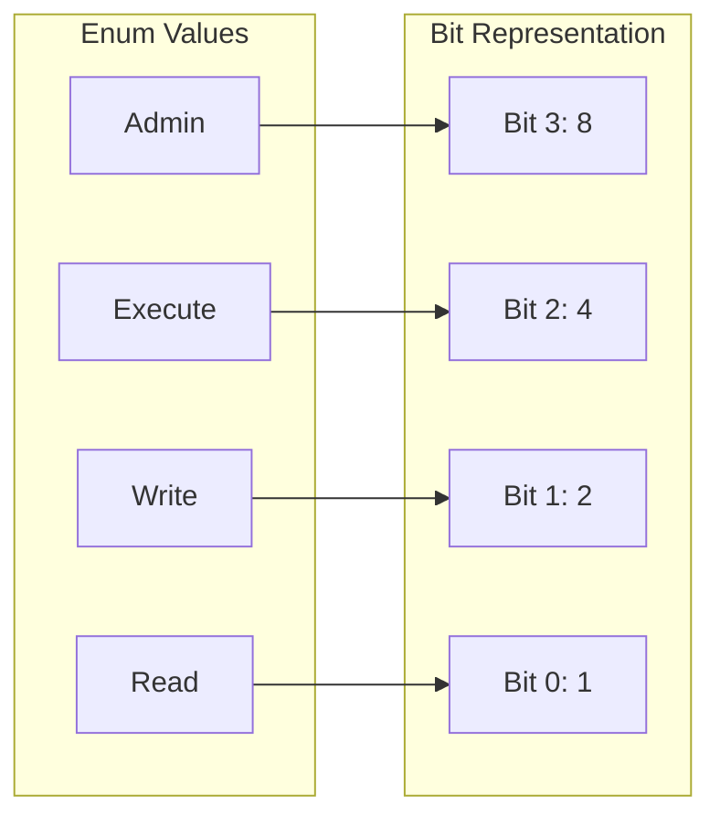

# Flagged Enums

**Goal:** Use Enums as a bit field to combine multiple values into a single variable efficiently.

---

## 1. The Problem: Mutually Exclusive Enums

By default, an Enum represents a set of mutually exclusive values. You can only pick **one** at a
time.

```csharp
enum Color
{
    Red,   // 0
    Green, // 1
    Blue   // 2
}

Color c = Color.Red; // "c" can't be Red AND Green at once.
```

---

## 2. The Solution: [Flags] Attribute

When you need to represent **combinations** of states (e.g., a file that is both "Hidden" and "
Read-Only"), you use **Flagged Enums**.

### Step 1: Add the `[Flags]` attribute

This tells the compiler and tools (like `ToString()`) that this Enum should be treated as a bit
field.

### Step 2: Use Powers of Two



Each value must represent a unique **bit**.

```csharp
[Flags]
public enum Permissions
{
    None    = 0,      // 0000
    Read    = 1 << 0, // 0001 (1)
    Write   = 1 << 1, // 0010 (2)
    Execute = 1 << 2, // 0100 (4)
    Admin   = 1 << 3  // 1000 (8)
}
```

> **Why bitwise?** Using powers of two (1, 2, 4, 8, 16...) ensures that each flag occupies exactly
> one bit, preventing overlap when they are combined.

---

## 3. Core Bitwise Operations

Flagged Enums rely on bitwise operators to manipulate the values.

### A. Combining Flags (OR `|`)

Use the `|` operator to "turn on" multiple bits.

```csharp
var myPermissions = Permissions.Read | Permissions.Write; 
// 0001 | 0010 = 0011 (Read + Write)
```

### B. Checking Flags (AND `&` or `HasFlag`)

Use the `&` operator to see if a specific bit is set, or the modern `.HasFlag()` method.

```csharp
// The classic way (fastest)
bool canRead = (myPermissions & Permissions.Read) == Permissions.Read;

// The modern way (more readable)
bool canWrite = myPermissions.HasFlag(Permissions.Write);
```

### C. Removing Flags (AND NOT `& ~`)

Use a combination of `&` and `~` (bitwise NOT) to "turn off" a bit.

```csharp
myPermissions &= ~Permissions.Write; // Removes "Write"
```

---

## 4. The "Golden Rule": Don't overlap bits!

If you don't use powers of two, your bits will "leak" into each other, causing unpredictable
behavior.

```csharp
// WRONG
[Flags]
enum BadEnum {
    Read = 1,    // 01
    Write = 2,   // 10
    Execute = 3  // 11 (Wait! This is actually Read + Write combined!)
}
```

In the example above, checking for `Execute` would return true if the user only has `Read` and
`Write`.

---

## 5. Summary & Use Cases

### When to use:

* **Multiple Options:** When an object can have several independent states at once.
* **Compact Storage:** Storing many booleans in a single integer (efficient for databases/network).
* **High Performance:** Bitwise operations are extremely fast at the CPU level.

### Common Examples:

* **File Attributes:** Read-only, Hidden, System, Archive.
* **User Permissions:** Create, Read, Update, Delete.
* **Logging Levels:** Error, Warning, Information, Debug.

---

## Comparison Table

| Feature       | Standard Enum           | Flagged Enum             |
|:--------------|:------------------------|:-------------------------|
| **Attribute** | None                    | `[Flags]`                |
| **Logic**     | "One of many"           | "Any of many"            |
| **Values**    | Sequential (0, 1, 2...) | Powers of 2 (1, 2, 4...) |
| **Combining** | Not possible            | Using ` operator \|`     | 
| **Check**     | Equality `==`           | Bitwise `&` or `HasFlag` |
| **Memory**    | Efficient               | Extremely Efficient      |
