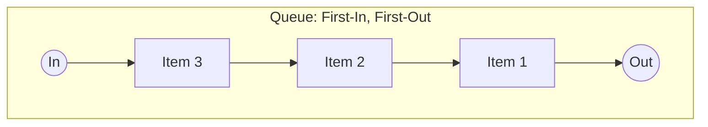
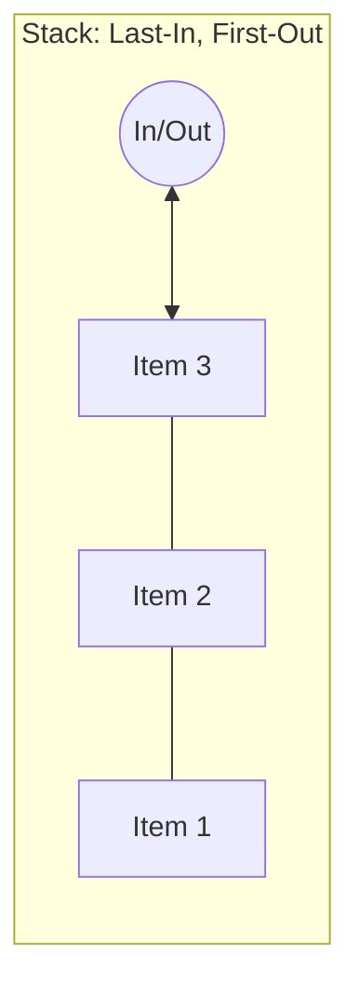
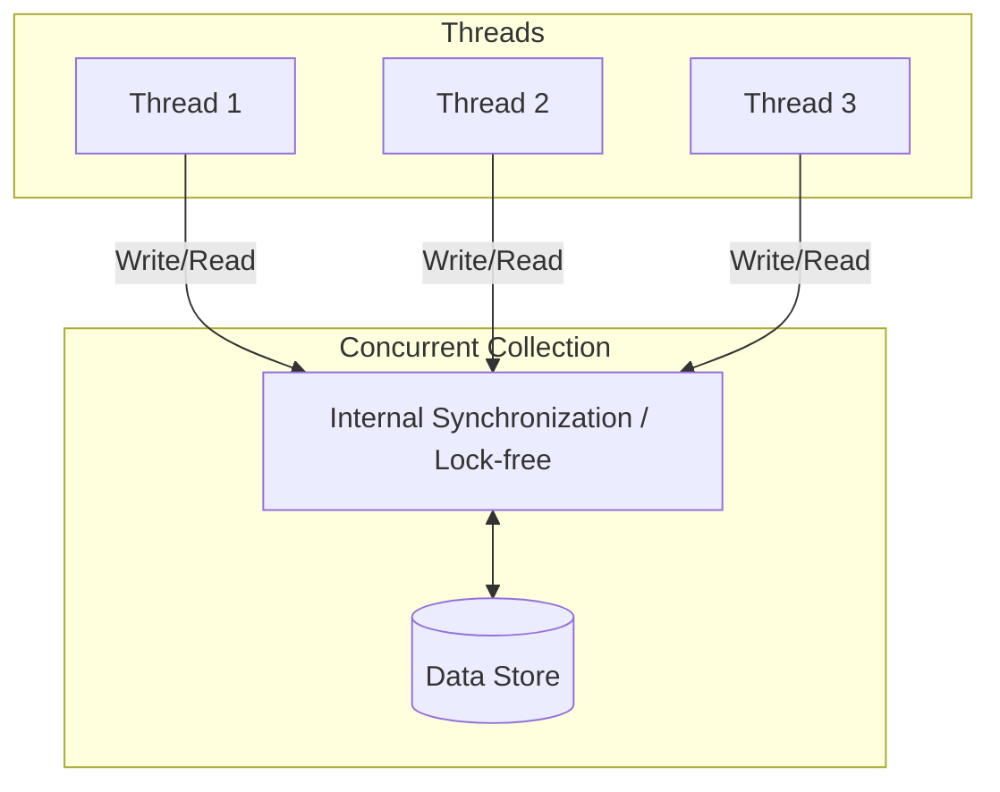

# .NET Collections: A Comprehensive Guide

Modern application development requires efficient data management. The .NET ecosystem provides a
robust set of collection types designed for various scenarios, ranging from simple in-memory lists
to complex, thread-safe structures for high-concurrency environments.

---

## 1. Generic Collections (`System.Collections.Generic`)

Generic collections are the foundation of data manipulation in C#. Introduced in .NET 2.0, they
solved the problems of type safety and performance (avoiding boxing/unboxing) associated with the
older non-generic collections like `ArrayList`.

### Key Benefits

- **Type Safety**: Errors are caught at compile-time rather than runtime.
- **Performance**: No need for boxing when storing value types, reducing GC pressure.
- **Code Reuse**: A single implementation works for any type `T`.

### Common Types

- `List<T>`: A dynamic array that grows as needed. Best for random access by index.
- `Dictionary<TKey, TValue>`: A collection of key/value pairs for fast lookups (O(1) average).
- `Queue<T>`: First-In, First-Out (FIFO).



- `Stack<T>`: Last-In, First-Out (LIFO).



```csharp
// Example of List<T> usage
var developers = new List<string> { "Alice", "Bob" };
developers.Add("Charlie");

// Example of Dictionary<TKey, TValue>
var salaryMap = new Dictionary<string, decimal>
{
    ["Alice"] = 90000,
    ["Bob"] = 95000
};
```

---

## 2. HashSet<T>

`HashSet<T>` is an unordered collection of unique elements. It is optimized for high-performance
set operations and existence checks.

### Characteristics

- **Uniqueness**: Automatically prevents duplicate entries.
- **Performance**: Provides O(1) time complexity for additions, removals, and lookups.
- **Set Operations**: Built-in support for `UnionWith`, `IntersectWith`, and `ExceptWith`.

### When to use it?

Use `HashSet<T>` when you need to ensure that a collection contains no duplicates and you
frequently need to check if an item exists within the set.

```csharp
var uniqueIds = new HashSet<int>();
bool added1 = uniqueIds.Add(101); // Returns true
bool added2 = uniqueIds.Add(101); // Returns false (already exists)

if (uniqueIds.Contains(101)) 
{
    // Fast O(1) lookup
}
```

---

## 3. Concurrent Collections (`System.Collections.Concurrent`)

When multiple threads access a collection simultaneously, standard generic collections can suffer
from data corruption or race conditions. Concurrent collections are designed for thread-safety
without requiring manual `lock` statements by the developer.

### Why not just use `lock`?

Manual locking is error-prone and can lead to deadlocks or significant performance bottlenecks.
Concurrent collections use fine-grained locking or lock-free algorithms (like `Interlocked`
operations) to maximize throughput.

### Common Types

- `ConcurrentDictionary<TKey, TValue>`: Thread-safe key/value pairs.
- `ConcurrentQueue<T>`: Thread-safe FIFO.
- `ConcurrentStack<T>`: Thread-safe LIFO.
- `ConcurrentBag<T>`: An unordered collection of objects, optimized for scenarios where the same
  thread both produces and consumes data.



```csharp
var inventory = new ConcurrentDictionary<string, int>();

// Thread-safe update pattern
inventory.AddOrUpdate("Laptop", 1, (key, oldValue) => oldValue + 1);
```

---

## 4. Immutable Collections (`System.Collections.Immutable`)

Immutable collections are collections that cannot be changed once they are created. Any operation
that would normally "modify" the collection instead returns a new instance with the changes
applied.

### Design Principles

- **Predictability**: You can safely pass an immutable collection to any method knowing it won't be
  modified.
- **Thread Safety**: Naturally thread-safe because they never change; no locking required.
- **Functional Style**: Encourages a functional programming approach where state is transformed
  rather than mutated.

### Memory Efficiency

Immutable collections use **structural sharing**. If you add an item to an `ImmutableList`, the new
list shares most of its memory with the old one, rather than copying the entire array.

```mermaid
graph LR
    subgraph "Original Collection"
        A[Item 1]
        B[Item 2]
    end

    subgraph "New Collection (Modified)"
        A
        B
        C[Item 3 'Added']
    end

    B --- A
    C --- B
    style A fill: #e55, stroke: #333
    style B fill: #e55, stroke: #333
    style C fill: #444, stroke: #333
```



```csharp
var original = ImmutableList.Create<string>("Red", "Green");
var modified = original.Add("Blue");

Console.WriteLine(original.Count); // Output: 2
Console.WriteLine(modified.Count); // Output: 3
```

---

### Comparison Summary

| Collection Category | Namespace                       | Primary Use Case                      | Thread Safety   |
|:--------------------|:--------------------------------|:--------------------------------------|:----------------|
| **Generic**         | `System.Collections.Generic`    | Standard single-threaded apps.        | Not Thread-Safe |
| **Concurrent**      | `System.Collections.Concurrent` | High-concurrency multi-threaded apps. | Thread-Safe     |
| **Immutable**       | `System.Collections.Immutable`  | Functional patterns, state sharing.   | Naturally Safe  |
| **HashSet**         | `System.Collections.Generic`    | Unique elements, fast lookups.        | Not Thread-Safe |